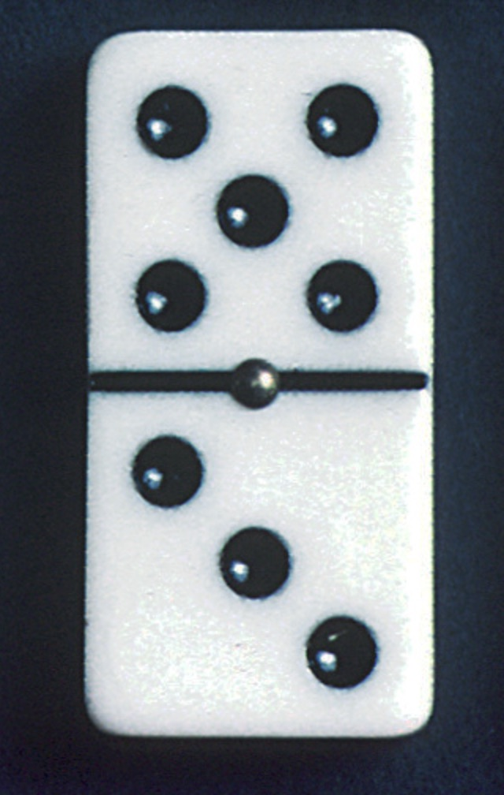
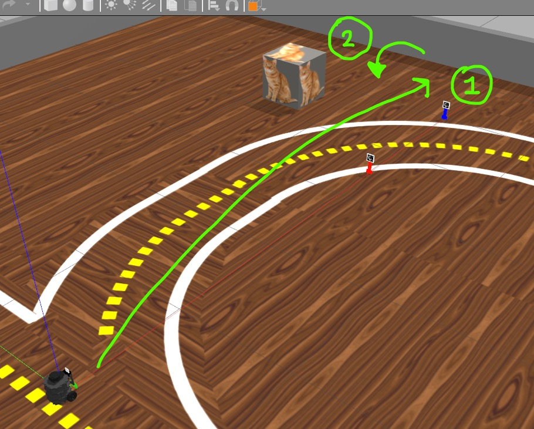
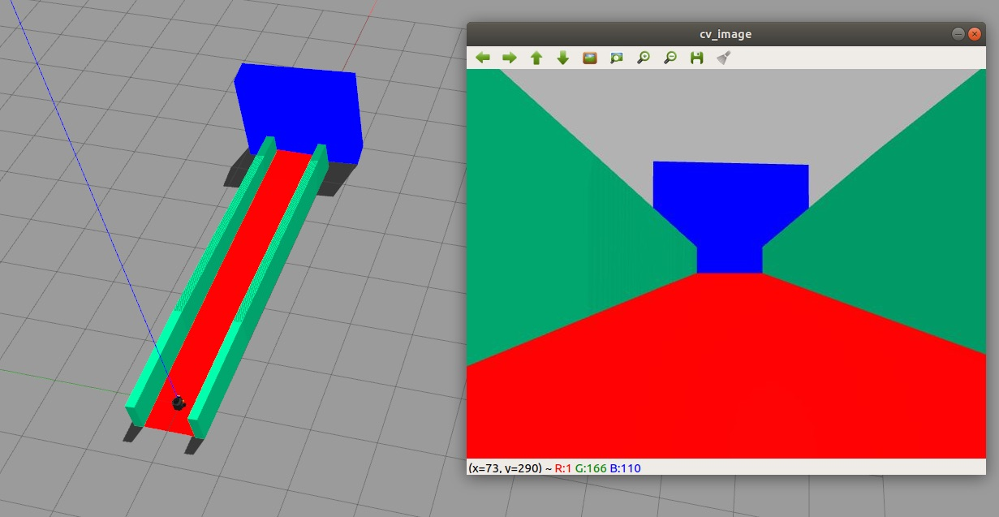

# Robótica Computacional 2021.1

[Mais orientações no README](./README.md)

## Simulado da prova

**Você deve escolher somente 2 questões para fazer.**

**Na prova real haverá 4 questões e você escolherá 3**

Esta prova é baseada na [sub de 2020.2](https://github.com/insper-classroom/202_robot_sub/blob/main/enunciado.ipynb)

Nome:_______________

Questões que fez:____________

Observações de avaliações nesta disciplina:

* Inicie a prova no Blackboard para a ferramenta de Proctoring iniciar. Só finalize o Blackboard quando enviar a prova via Github classroom
* Durante esta prova vamos registrar somente a tela, não a câmera nem microfone
* Ponha o nome no enunciado da prova no Github
* Tenha os repositórios https://github.com/Insper/robot21.1/ ,  https://github.com/arnaldojr/my_simulation e https://github.com/arnaldojr/mybot_description.git  atualizados em seu `catkin_ws/src` .
* Você pode consultar a internet ou qualquer material, mas não pode se comunicar com pessoas ou colegas a respeito da prova
* Todos os códigos fornecidos estão executando perfeitamente. Foram testados no SSD da disciplina
* Teste sempre seu código
* Entregue código que executa - código com erro que impede de executar implica em zero na questào
* Faça commits e pushes frequentes no seu repositório (tem dicas [no final deste arquivo](./inst
rucoes_setup.md))
* Esteja conectado no Teams e pronto para receber calls do professor e da equipe. 
* Avisos importantes serão dados no chat da prova no Teams - deixe o Teams aberto
* Permite-se consultar qualquer material online ou próprio. Não se pode compartilhar informações com colegas durante a prova
* Faça commits frequentes. O primeiro a enviar alguma ideia será considerado autor original
* A responsabilidade por ter o *setup* funcionando é de cada estudante
* Questões de esclarecimento geral podem ser perguntadas no chat do Teams
* Se você estiver em casa pode fazer pausas e falar com seus familiares, mas não pode receber ajuda na prova.
* É proibido colaborar ou pedir ajuda a colegas ou qualquer pessoa que conheça os assuntos avaliados nesta prova.
* Os exercícios admitem diversas estratégias de resolução. A prova de cada aluno é única
* Se precisar reiniciar para alternar entre Linux e seu sistema nativo reinicie o Proctoring e avise o professor via chat. 

Existe algumas dicas de referência rápida de setup [instrucoes_setup.md](instrucoes_setup.md)

**Integridade Intelectual**

Se você tiver alguma evidência de fraude cometida nesta prova, [use este serviço de e-mail anônimo](https://www.guerrillamail.com/pt/compose)  para informar ao professor.  Ou [este formulário](https://forms.gle/JPhqjPmuKAHxmvwZ9)

# Questões

## Questão 1  (3.33 pontos)

#### Orientações

Trabalhe no arquivo `q1/q1.py`. Este exercício **não precisa** de ROS. Portanto pode ser feito até em Mac ou Windows

Você vai notar que este programa roda o vídeo `dominoes.mp4`. Baixe o vídeo [neste endereço](https://github.com/Insper/robot20/raw/master/media/dominoes.mp4)

#### O que você deve fazer:

Um programa que escreve *na tela* o valor da peça de dominó que aparece a cada frame do vídeo. 

Por exemplo para a peça acima, deve escrever **5 por 3**

|Resultado| Conceito| 
|---|---|
| Não executa | zero |
| Segmenta ou filtra a imagem baseado em cores ou canais da imagem e produz output visual| 0.6|
| Identifica os círculos | 1.7|
|Descobre como separar a parte de cima da de baixo da peça| 2.2 |
| Dá resultados mas não está perfeito | 2.8 |
| Resultados perfeitos | 3.33|

Casos intermediários ou omissos da rubrica serão decididos pelo professor.

## Questões de ROS

**Atenção: ** 

Para fazer estra questão você precisa ter o `my_simulation` e o `mybot_description` atualizado.

    cd ~/catkin_ws/src
    cd my_simulation
    git stash
    git pull

Ou então se ainda não tiver:

    cd ~/catkin_ws/src
    git clone https://github.com/arnaldojr/my_simulation.git

Para o mybot_description:

    cd ~/catkin_ws/src
    cd mybot_description
    git stash
    git pull

Ou então se ainda não tiver:

    cd ~/catkin_ws/src
    git clone https://github.com/arnaldojr/mybot_description

Em seguida faça o [catkin_make](./instrucoes_setup.md). 

## Questão 2

Para executar o cenário, faça:

    roslaunch my_simulation pista_s.launch

Seu robô está num cenário como o que pode ser visto na figura: 

</img>

#### O que é para fazer

Um código capaz de: 

Fazer o robô seguir em frente até parar a $80 cm$ da parede.

Depois ele deve girar e procurar o gato, centralizando-o na imagem. Se o gato estiver muito grande para ser visto o robô deve se afastar para permitir a visão. 

O programa termina com o robô tendo uma boa visão do gato aproximadamente centralizado na imagem.

#### Detalhes de como rodar

O código para este exercício deve estar em: `sim211/scripts/Q2.py`

**Faça o download os pesos da rede neural para seu diretório. Estão em**

[https://github.com/Insper/robot21.1/raw/main/aula03/mobilenet_detection/MobileNetSSD_deploy.prototxt.txt](https://github.com/Insper/robot21.1/raw/main/aula03/mobilenet_detection/MobileNetSSD_deploy.prototxt.txt)

[https://github.com/Insper/robot21.1/raw/main/aula03/mobilenet_detection/MobileNetSSD_deploy.caffemodel](https://github.com/Insper/robot21.1/raw/main/aula03/mobilenet_detection/MobileNetSSD_deploy.caffemodel)

Depois *salve* estes pesos na pasta: 

`sim211/scripts`

[O notebook ./sim211/scripts/baixa_arquivos.ipynb](./sim211/scripts/baixa_arquivos.ipynb)  é capaz de baixar estes arquivos no lugar certo se você estiver no Linux.

Depois o seu código:

    rosrun sim211 Q2.py

|Resultado| Conceito| 
|---|---|
| Não executa | 0 |
| Vai em frente| 0.2|
| Para a 40 cm da parede | 1.0|
| Gira e procura o gato | 2.0 |
| Faz o necessário para enquadrar bem o gato e para com ele centralizado | 3.33|

Casos intermediários ou omissos da rubrica serão decididos pelo professor.

## Questão 3 (3.33 pontos)

</img>

Seu robô está no cenário visível abaixo:

    roslaunch my_simulation rampa.launch

#### O que é para fazer

Estime o ponto de fuga da rampa a partir das paredes verdes. Use o ponto de fuga para fazer o robô percorrer a pista corretamente. 

#### Detalhes de como rodar

O código para este exercício está em: `sim211/scripts/Q3.py`

Para rodar, recomendamos que faça:

    roslaunch my_simulation rampa.launch

Depois:

    rosrun sim211 Q3.py

|Resultado| Conceito| 
|---|---|
| Não executa | 0 |
| Segmenta o verde | 0.75 |
| Encontra as retas das laterais | 1.5 |
| Acha o ponto de fuga| 2.2|
| Guia o robo com base no ponto de fuga | 3.33|

Casos intermediários ou omissos da rubrica serão decididos pelo professor.
